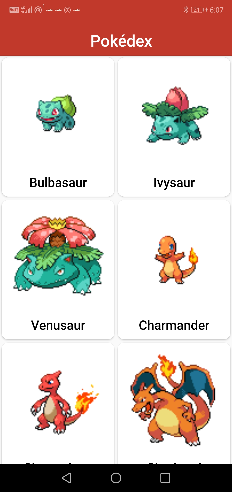
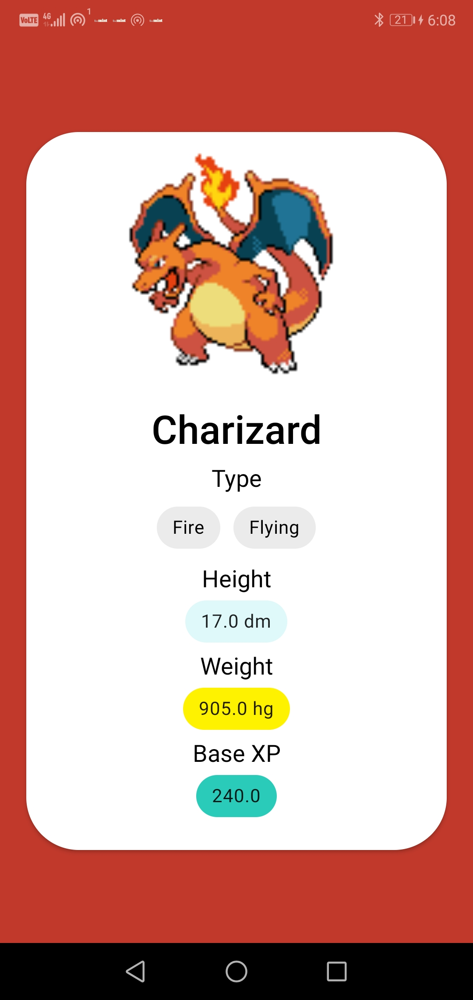

# Pokedex
A simple Pokedex made using the PokeApi made in Android Studio using Java. 
I created this application to learn a bit on Retrofit , Glide and RecyclerViews. 
The app does not has pagination enabled. 
I will try to add that ASAP 

 <b>Homepage with the list of all the Pokemons. </b>  

 <b>Page showing details of the selected Pokemon.</b>  

